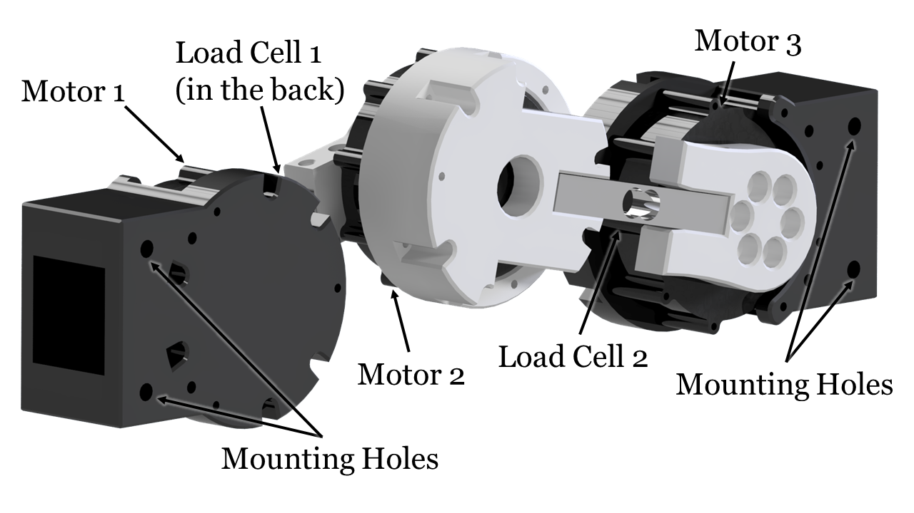
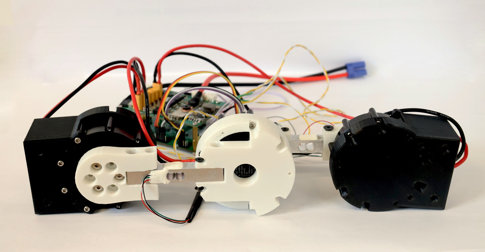

<h1 align="center">
  SPARC: Spine with Prismatic and Revolute Compliance for Quadruped Robots
  <br><br>
  <a href="#"></a>
  <br>
</h1>

<p align="center">
An open-source 3-DoF sagittal-plane spine module that combines revolute (pitch) and prismatic (axial) motion with programmable task-space impedance for quadruped robots. This repository provides complete hardware designs, circuit schematics, and MuJoCo simulation code for building and testing the SPARC system.
</p>

## Overview

<p align="center">
  
  <br>
  <em>SPARC spine structure with 3-DoF sagittal plane motion</em>
</p>

SPARC is a compact, self-contained spine module (1.26 kg) designed to mount between the fore and hind body segments of quadruped robots. The system integrates three torque-controlled actuators (Xiaomi Cybergear), a 1 kHz motion control board (STM32F405), and protected power electronics in a single package. A floating-base impedance controller with dynamics compensation renders tunable spring-damper behavior along horizontal, vertical, and rotational axes, enabling closed-loop control of both revolute and prismatic degrees of freedom with axis-selective compliance.

## Features

- **3-DoF Sagittal Spine**: Combined revolute (pitch) and prismatic (axial) motion for bio-inspired compliance
- **Task-Space Impedance Control**: Independently tunable stiffness and damping along horizontal, vertical, and rotational axes (validated range: 300-700 N/m horizontal stiffness with ≤1.5% error, R² ≥ 0.992)
- **High-Bandwidth Control**: 1 kHz control loop design with dynamics compensation and Stribeck friction modeling
- **Compact Design**: 1.26 kg package with three quasi-direct-drive actuators (12 N·m peak torque each)
- **Open-Source Hardware**: Complete CAD models and circuit schematics
- **MuJoCo Simulation**: Reference implementation and testing environment for spine compliance effects on locomotion

## Repository Structure

```
sparc/
├── hardware/
│   ├── cad_models_inventor/      # Autodesk Inventor CAD models and assemblies
│   └── circuit_altium_designer/  # Altium Designer circuit schematics and PCB layouts
├── mujoco_simulation/
│   ├── asset/                    # URDF/XML models and STL meshes
│   ├── spine_impedance_controller.py  # Task-space impedance controller implementation
│   ├── main_spine.py             # Basic spine simulation
│   ├── main_robot.py             # Quadruped bounding gait simulation
│   ├── dog_controller_no_cpg.py  # Quadruped leg controller
│   └── mujoco_interface.py       # MuJoCo simulation interface
├── images/                       # Project images and diagrams
├── LICENSE                       # MIT License
└── README.md                     # This file
```

## Hardware Design

<p align="center">
  
  <br>
  <em>SPARC hardware prototype with integrated actuators and electronics</em>
</p>

The `hardware/` directory contains complete mechanical and electrical designs ready for fabrication:

- **CAD Models** ([cad_models_inventor/](hardware/cad_models_inventor/)): Autodesk Inventor files with complete spine assembly, 3D-printed links, and mounting interfaces for quadruped integration
- **Circuit Schematics** ([circuit_altium_designer/](hardware/circuit_altium_designer/)): Altium Designer project files for Motion Control Board (MCB) and Power Management Unit (PMU)

### Key Components

- **Actuators**: 3× Xiaomi Cybergear quasi-direct-drive motors (12 N·m peak torque, CAN bus interface)
- **Motion Control Board (MCB)**:
  - STM32F405RGT6 microcontroller (@168 MHz)
  - CAN transceiver for multi-actuator communication
  - Onboard 6-axis IMU for attitude estimation
  - USB interface for parameter tuning and debugging
- **Power Management Unit (PMU)**:
  - Input: 6S LiPo (22.2V nominal) or 24V bench supply
  - Over-current protection and thermal monitoring
  - Filtered power distribution to MCB and actuators
- **Sensing (Optional)**:
  - 2× load cells on central links for direct torque measurement
  - Magnetic encoders integrated in Cybergear actuators (14-bit resolution)
- **Structure**:
  - Lightweight 3D-printed links (PLA/PETG)
  - Mass distribution: 75% concentrated at actuators to minimize reflected inertia
  - Total spine mass: 1.26 kg

**Note**: Control software needs to be developed based on your specific requirements and the impedance control algorithms demonstrated in the simulation code.

## MuJoCo Simulation

The `mujoco_simulation/` directory provides simulation environments for testing and developing control algorithms for the SPARC spine.

### Available Simulations

1. **Basic Spine Simulation** ([main_spine.py](mujoco_simulation/main_spine.py))
   - Standalone spine characterization with manual displacement tests
   - Task-space impedance controller demonstration across 300-700 N/m stiffness range
   - Generates quasi-static force-displacement curves and dynamic step responses
   - Ideal for controller tuning and parameter exploration

2. **Quadruped Bounding Gait** ([main_robot.py](mujoco_simulation/main_robot.py))
   - Full 8-DoF quadruped robot with integrated SPARC spine
   - Bounding gait generator with configurable frequency, stride length, and step height
   - Real-time spine compliance adjustment during locomotion
   - Cost of transport optimization demonstrations
   - Supports terrain slope variation for performance analysis

### Simulation Features

- **Physics-accurate dynamics**: Task-space impedance control using batched CRBA/RNEA algorithms via [bard-pytorch-dynamics](https://github.com/YueWang996/bard-pytorch-dynamics)
- **Friction modeling**: Smooth Stribeck compensation for realistic low-velocity behavior
- **Complete robot models**: URDF files with inertial parameters and collision geometries
- **Real-time visualization**: Interactive MuJoCo viewer with parameter adjustment
- **Data logging**: CSV export for post-analysis and plotting

The simulation code provides a reference implementation of the impedance control algorithms that can be adapted for embedded systems.

## Getting Started

### Prerequisites

- Python 3.8+
- [MuJoCo](https://mujoco.org/) (for physics simulation)
- [bard-pytorch-dynamics](https://github.com/YueWang996/bard-pytorch-dynamics) (batched articulated robot dynamics solver)

### Installation

1. **Clone the repository**
   ```bash
   git clone https://github.com/YueWang996/sparc.git
   cd sparc
   ```

2. **Install MuJoCo**

   Follow the official [MuJoCo installation guide](https://mujoco.readthedocs.io/en/stable/programming/index.html#getting-started).

3. **Install bard-pytorch-dynamics**

   Follow the installation instructions at the [bard-pytorch-dynamics repository](https://github.com/YueWang996/bard-pytorch-dynamics.git):
   ```bash
   git clone https://github.com/YueWang996/bard-pytorch-dynamics.git
   cd bard-pytorch-dynamics
   # Follow the specific installation steps in that repository's README
   ```

4. **Install additional Python dependencies**
   ```bash
   pip install numpy scipy torch
   ```

### Usage

**Run the basic spine simulation:**
```bash
cd mujoco_simulation
python main_spine.py
```

This launches an interactive MuJoCo viewer where you can manually apply forces to the spine and observe the impedance response. Modify `kx`, `kz`, `kθ` (stiffness) and `dx`, `dz`, `dθ` (damping) parameters in the script to explore different compliance behaviors.

**Run the quadruped bounding gait simulation:**
```bash
cd mujoco_simulation
python main_robot.py
```

This simulates a complete quadruped performing bounding locomotion. Adjust the following parameters in `main_robot.py`:
- Spine stiffness/damping: `kx`, `kz`, `kθ`, `dx`, `dz`, `dθ`
- Gait parameters: `frequency`, `stride_length`, `step_height`
- Terrain: `slope_angle`

The simulation logs kinematic data to CSV files for offline analysis and visualization.

## Building Your Own SPARC

To replicate the hardware:

1. **3D Printing**: Export STL files from the Inventor assemblies in `hardware/cad_models_inventor/` and print using PLA or PETG
2. **PCB Fabrication**: Use the Altium Designer files in `hardware/circuit_altium_designer/` to generate Gerber files for PCB manufacturing
3. **Component Sourcing**:
   - 3× Xiaomi Cybergear motors (available from Xiaomi robotics distributors)
   - 2× Load cells (e.g., TAL220 10kg or similar)
   - STM32F405RGT6 microcontroller and supporting components (see BOM in circuit files)
   - 6S LiPo battery or 24V power supply
4. **Assembly**: Follow the CAD assembly structure for mechanical integration
5. **Control Software**: Develop your own control code using the simulation algorithms as reference. The [spine_impedance_controller.py](mujoco_simulation/spine_impedance_controller.py) provides the core impedance control implementation

For detailed build instructions, please refer to the documentation in the `hardware/` subdirectories.

## Performance Characteristics

The SPARC spine has been tested in both hardware benchtop experiments and MuJoCo simulations:

- **Static Stiffness**: Horizontal stiffness control from 300-700 N/m with high linearity (R² ≥ 0.992) across ±60 mm displacement range
- **Dynamic Response**: Tunable damping behavior from 0-40 N·s/m with predictable settling characteristics
- **Axis-Selective Compliance**: Independent control of horizontal, vertical, and rotational stiffness through task-space impedance control
- **Simulation Results**: Terrain-dependent optimal compliance settings:
  - **Downhill slopes**: Higher stiffness (1000-1500 N/m) reduces excessive pitch-down
  - **Flat terrain**: Moderate stiffness (800-1200 N/m) balances efficiency and stability
  - **Uphill slopes**: Lower stiffness (500-1000 N/m) enables elastic energy storage
  - **Optimal stride lengths (70-80 mm)**: Lowest cost of transport with 500-800 N/m stiffness and 8-20 N·s/m damping

These results suggest that adaptive spine compliance can reduce energy costs in quadruped locomotion across varying terrains and gaits.

## Citation

If you use this work in your research, please cite:

```bibtex
@article{wang2026sparc,
  title={SPARC: Spine with Prismatic and Revolute Compliance for Quadruped Robots},
  author={Wang, Yue},
  journal={arXiv preprint arXiv:2510.01984},
  year={2026}
}
```

## Applications and Integration

SPARC is designed as a modular component for quadruped robotics research. Potential applications include:

- **Locomotion Research**: Investigate the role of spinal compliance in gait transitions, energy efficiency, and stability
- **Terrain Adaptation**: Study real-time compliance tuning for varying surfaces and slopes
- **Bio-Inspired Robotics**: Explore mammalian spine mechanics in robotic systems
- **Agile Maneuvers**: Leverage spine compliance for jumping, landing, and rapid direction changes
- **Educational Platform**: Teach task-space impedance control and legged robot dynamics

The mounting interface is compatible with common quadruped platforms. Researchers can integrate SPARC by mounting it between fore and hind body segments using the provided bolt pattern.

## Troubleshooting and FAQ

**Q: The simulated spine oscillates excessively at low damping.**
A: Ensure the friction compensation parameters in [spine_impedance_controller.py](mujoco_simulation/spine_impedance_controller.py) match your system. Slight over-compensation can cause instability at `dx = 0`. Increase damping to `dx ≥ 2` N·s/m for stable operation.

**Q: How do I implement the controller on hardware?**
A: Use the simulation code in [spine_impedance_controller.py](mujoco_simulation/spine_impedance_controller.py) as a reference for implementing the task-space impedance control on your embedded system. The core algorithms (CRBA/RNEA, Jacobian computation, friction compensation) can be adapted to C/C++ for real-time execution.

**Q: Can I use different actuators?**
A: Yes, but you'll need to update the mechanical design to accommodate different motor dimensions and mounting patterns, and adapt your control software for different communication protocols.

**Q: What control loop frequency should I target?**
A: The design targets 1 kHz for effective bandwidth up to ~50-100 Hz depending on the commanded stiffness and system configuration.

## Contributing

Contributions are welcome! Areas where community input would be particularly valuable:

- Control software implementations for embedded systems
- Integration guides for specific quadruped platforms
- Additional simulation scenarios and benchmarks
- Experimental validation on different terrains
- Extended control strategies (MPC, reinforcement learning, etc.)

Please open an issue to discuss major changes before submitting pull requests.

## License

This project is licensed under the MIT License - see the [LICENSE](LICENSE) file for details.

## Contact

For questions or collaboration opportunities:
- Open an issue in this repository
- GitHub: [@YueWang996](https://github.com/YueWang996)

## Acknowledgments

This work is supported by the School of Electronic and Computer Science (ECS), University of Southampton.

We thank the open-source robotics community for tools and libraries that made this work possible, including MuJoCo, the PyTorch ecosystem, and the legged robotics research community for valuable discussions and feedback.

---

**SPARC is an open-source platform for exploring spine compliance in legged locomotion.** Hardware designs and simulation code are provided for the robotics research community to build upon and extend.
